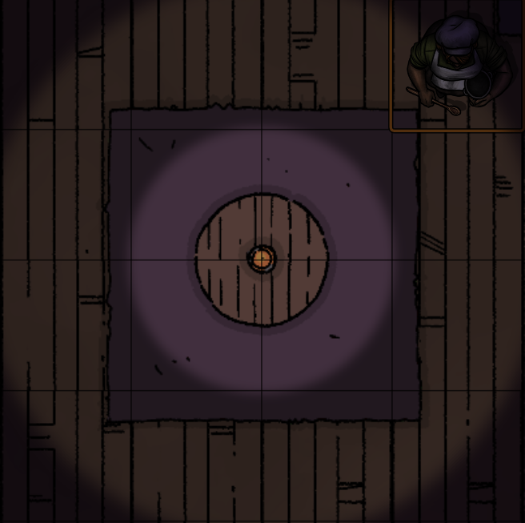
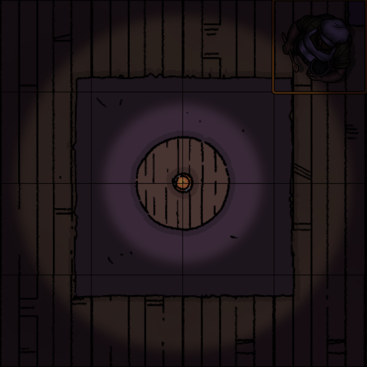
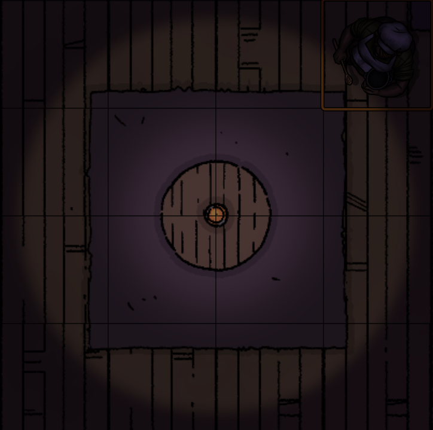
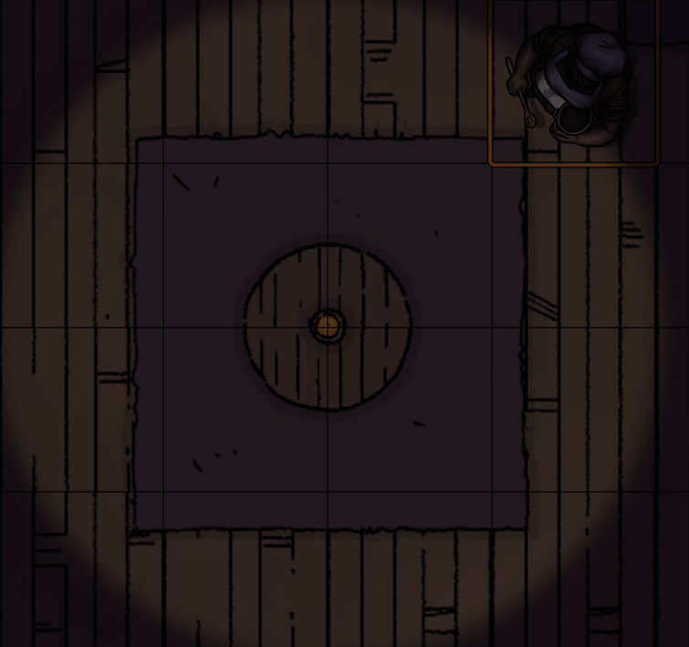
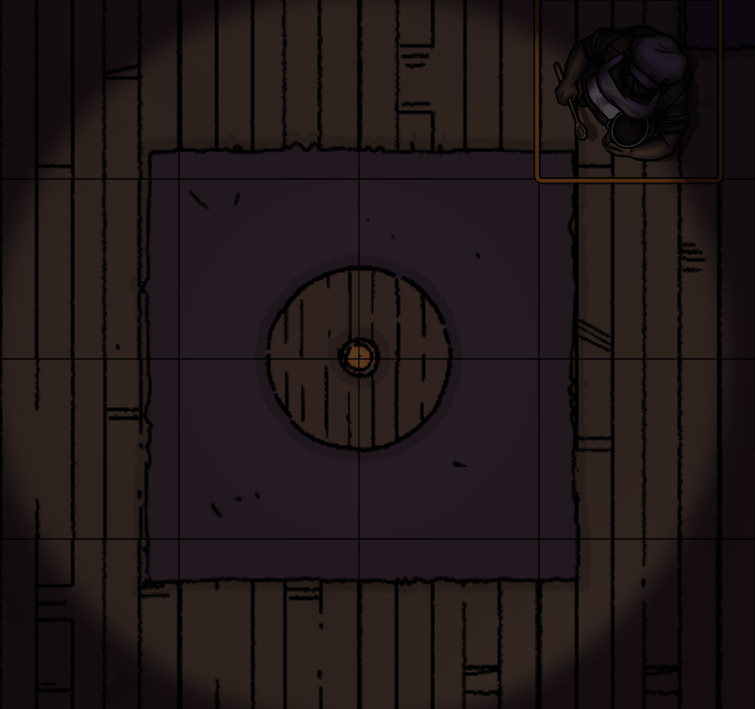
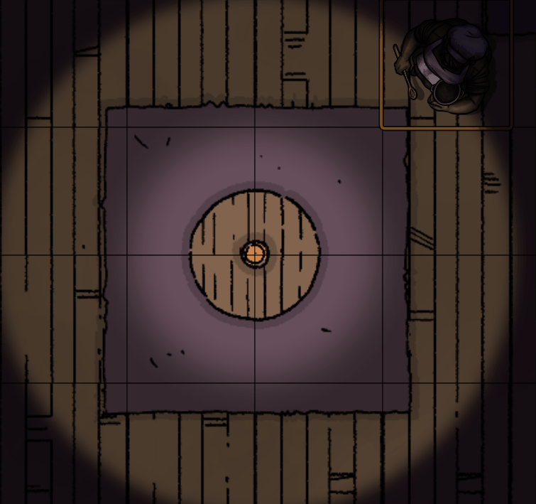

# Dancing Lights

Better ambient lighting for Foundry VTT.
Designed to avoid server-side light updates by directly modifying the lights PIXI elements client-side.

Currently supports light blurring, fire-style animation with custom colors, blinking lights, fading lights and 'electrical fault' style lights.

All default light settings should work with Dancing Lights, except where specified (fire will disable chosen light color for example, using the 2 new fire colors instead)

## Basic configuration

1. Create or update a light
2. Scroll down in the lights settings to find the Dancing Lights section
3. Check 'Enable Dancing Lights'
4. Change the Dancing Lights settings to your taste
5. Click 'Update Light'
6. Select a token with vision on the light to see the results

## Dancing Lights in action

[Demo Video](https://youtu.be/eVwkINKb1nk)

Note that the gifs below were recorded at ~15fps. Your results should look a little smoother.

### Performance

This module has been designed with performance in mind. A test with 72 fire lights in a scene runs flawlessly on my machine (admittedly well spec'd).

If you hit any performance issues, I would love some feedback with your browser details, specs, light options etc.

### Light options

#### Standard

#### Blur

Light blur

Heavy blur

#### Fire

Default

Colored

#### Blink

#### Fade

#### Electric Fault

#### Animate Dim

Example of Animate Dim enabled, on a fade light

## Troubleshooting

### My token view is too dim!

Disable the 'Dim token Bright Vision' option in module settings, or set the slider to a high number

### My lights are dim in the centre, or I can't see the bright light

Make sure your 'Blur Amount' isn't too high. Try disabling blur.

### One of my players is playing on a toaster

You can have them disable Dancing Lights or change the update speed in their module settings. This won't affect any other players.

### Your module broke X!

Disable the module in 'Manage Modules'. I'm sorry for your loss... Try pinging me on Discord.

## Manifest

`https://raw.githubusercontent.com/BlitzKraig/fvtt-DancingLights/master/module.json`

## Feedback

This module is open for feedback and suggestions! I would love to improve it and implement new features.

For bugs/feedback, create an issue on GitHub, or contact me on Discord at Blitz#6797

## [Release Notes](./CHANGELOG.md)
